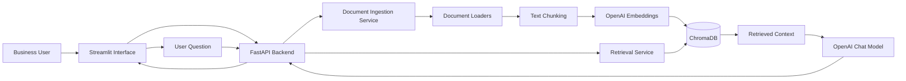

# RAG-Powered Document Intelligence Platform

A production-ready document assistant that allows business users to upload internal documents, index them into a vector database, and ask grounded questions using retrieval-augmented generation (RAG).

## Overview

The platform helps teams quickly find insights from policies, reports, contracts, manuals, and meeting notes by combining document ingestion, embeddings, semantic retrieval, and LLM-powered answer generation.

## Key Features

- Multi-format document upload (PDF, DOCX, TXT, Markdown, CSV, XLSX)
- Secure file processing and validation
- Chunking and embedding generation
- ChromaDB-backed vector search
- Grounded question answering with citations
- Conversation session support
- Document management and deletion
- Streamlit-based business UI

## Architecture



## Tech Stack

- Python 3.11+
- FastAPI
- Streamlit
- ChromaDB
- OpenAI API
- LangChain
- PyPDF2, python-docx, pandas, openpyxl, BeautifulSoup4
- pytest, Ruff, Black, mypy
- Docker and Docker Compose

## Project Structure

```text
rag-document-intelligence/
├── app/
├── frontend/
├── data/
├── tests/
├── scripts/
├── .github/workflows/
└── docker-compose.yml
```

## Installation

```bash
python -m venv .venv
source .venv/bin/activate  # Windows: .venv\\Scripts\\activate
pip install -r requirements.txt
cp .env.example .env
```

## Local Development

```bash
make install
make run-api
make run-frontend
```

## Docker

```bash
docker compose up --build
```

## Example Questions

- What is the annual leave policy?
- Summarize the main risks mentioned in this report.
- What payment terms are included in the uploaded contract?

## Testing

```bash
make test
make coverage
make lint
make type-check
```

## Security Considerations

- Uploaded files are validated by extension and size.
- Filenames are sanitized.
- File paths are kept within the application data directory.
- Secrets should be stored in environment variables.
- Authentication and authorization hooks should be added in a production deployment.

## Known Limitations

- The current implementation uses local file storage and ChromaDB persistence.
- OCR is not included for scanned PDFs.
- Authentication is not yet implemented.

## Future Improvements

- User authentication and RBAC
- Background ingestion jobs
- OCR and hybrid search
- PostgreSQL metadata persistence
- Reranking and evaluation with RAGAS
```
